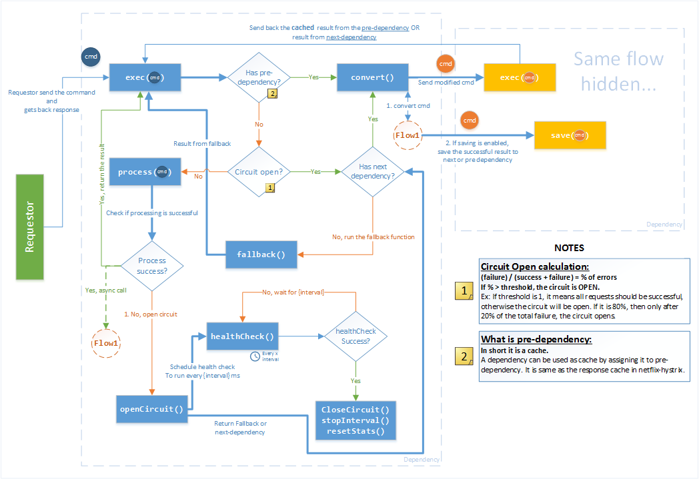

## dependency-brakes (poc-draft implementation) ##

This script is for testing the circuit breaker pattern with dependency fallback mechanism.

The selected NPM package for the circuit breaker is: https://www.npmjs.com/package/brakes

It uses circuit breaker for internal fallback and health check mechanism for the dependencies.

Here is the detailed diagram of the flow:



#### Scripts: ####

testMongoBrakes.js : This is the example script to use the circuit breaker from "brakes"

It CAN also stream the event on port 8091, you need to configure dashboard to listen on this port. See examples in folder 'OtherCircuitBreakerTypes'

#### Examples ####

##### Memory > Mongo > Dummy Dependency Order #####
```javascript
const MongoBrakes = require('./CircuitBreakers/MongoBrakes');
const DummyBrakes = require('./CircuitBreakers/DummyBrakes');
const MemoryBrakes = require('./CircuitBreakers/MemoryBrakes');

var dummyBrake = new DummyBrakes();
var memoryBrake = new MemoryBrakes({ttlMs: 10000});

var mongoBrake = new MongoBrakes({
	col: 'documents',
	url: 'mongodb://localhost:27017/myproject',
	next: dummyBrake,
	nextConverter: cmd => {return {key: cmd.collection + '/data.json'};},
	pre: memoryBrake,
	preConverter: cmd => {return {key: JSON.stringify(cmd)};},
	fallbackToPromiseError: true
});

mongoBrake.on("internalerror", err => {
	console.error(err);
	process.exit(); //we dont want fallback to execute for internal errors (like wrong syntax in parameter)
});

var loop3 = function() {

	var cmd = {collection: "documents", cursor: {find: {"a":1}, limit: 1}};//, nextCmd: {key:"documents/all_limit1.json"}};
	mongoBrake.exec(cmd).then(docs => {
		console.log(`doc1: ${JSON.stringify(docs)}`);
	}).catch(err => {
		console.log(err);
		if (err.isFallback) {
			console.log("----it is fallback---");
			err.getNext().exec(cmd).then(docs2 => {
				//get and parse the results....
			});
		}
	});
};

console.log("-----Testing the MongoBrakes with fallback as promise-------");
setInterval(loop3, 1000);
```

#### Dashboard ####

The source of dashboard: 
https://github.com/spring-cloud-samples/hystrix-dashboard
 
I have included a compiled version of the dashboard, go into the Dashboard folder

```
java -jar hystrix-dashboard-0.0.1.BUILD-SNAPSHOT.jar
```

it should start the dashboard on default port `7979`.
Then you can add your stream to the dashboard. (localhost:8091)
